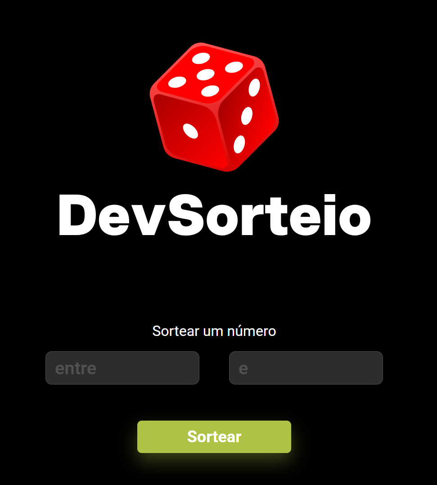

# 🎲 Sorteador de Números

Aplicação web para sortear números aleatórios dentro de um intervalo definido pelo usuário. Desenvolvida durante minha transição de carreira para a área de tecnologia.

---

## 🖥️ Demonstração



---

## ✨ Funcionalidades

- 🔢 Define o **intervalo mínimo e máximo** para o sorteio
- 🎯 Gera um **número aleatório** dentro do intervalo escolhido
- 🔄 Botão de **reiniciar** para realizar um novo sorteio
- 🎨 Interface visual limpa e intuitiva

---

## 🛠️ Tecnologias Utilizadas


| Tecnologia | Uso |
|---|---|
| HTML5 | Estrutura da página |
| CSS3 | Estilização e layout |
| JavaScript (ES6+) | Lógica de sorteio e manipulação do DOM |

---

## 🧠 Como Funciona

O sorteio utiliza a função nativa `Math.random()` do JavaScript combinada com `Math.floor()` para gerar um número inteiro aleatório dentro do intervalo definido pelo usuário:

```js
Math.floor(Math.random() * (max - min + 1)) + min
```

---

## 🚀 Como Rodar o Projeto

Não precisa instalar nada! É um projeto de HTML, CSS e JavaScript puro.

```bash
# Clone o repositório
git clone https://github.com/GiulianoMarrocco/Projeto-Sorteador.git

# Entre na pasta
cd Projeto-Sorteador

# Abra o arquivo no navegador
# Clique duas vezes no index.html
# ou use a extensão Live Server no VS Code
```

---

## 📂 Estrutura do Projeto

```
Projeto-Sorteador/
├── index.html    # Estrutura da página
├── style.css     # Estilização
├── script.js     # Lógica de sorteio
└── assets/       # Imagens e ícones
```

---

## 👨‍💻 Sobre o Projeto

Este projeto foi desenvolvido como parte da minha jornada de transição de carreira para a área de tecnologia. O foco foi praticar a manipulação do DOM com JavaScript puro, trabalhando com eventos, inputs do usuário e atualização dinâmica da interface.

---

## 📬 Contato

Feito por **Giuliano Marrocco**

[](https://github.com/GiulianoMarrocco)
[](https://linkedin.com/in/seu-perfil)

---

## 📝 Licença

Este projeto está sob a licença MIT.

